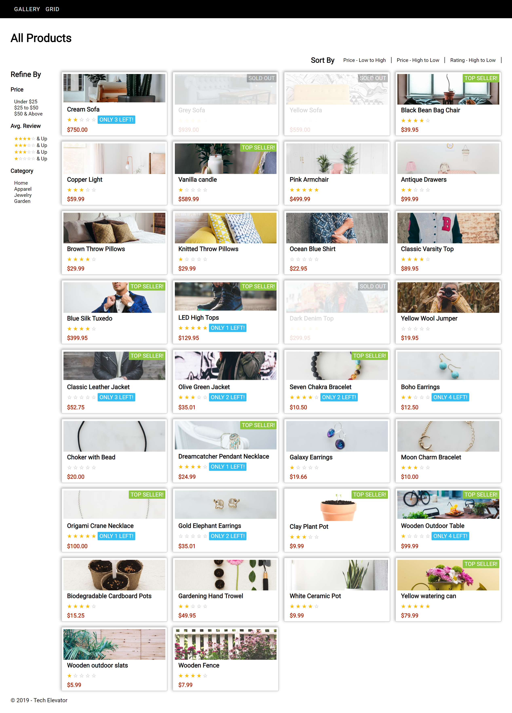
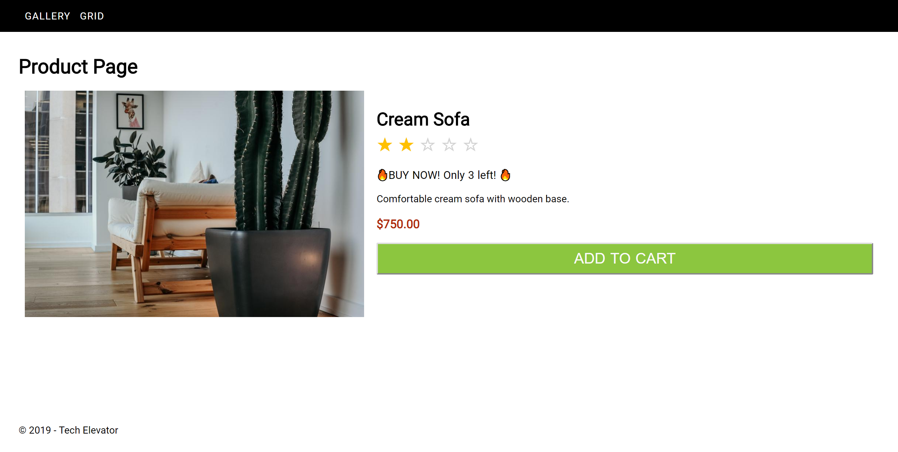

# MVC Views - Part 2 (Day 1)

The purpose of this exercise is to provide you the opportunity to practice using complex data that is provided from a "controller" in your views. 

## Learning Objectives

After completing this exercise, students will understand:

- How to effectively present complex model data on a view.
- How to use JSTL conditional statements (if/else) to show/hide HTML and CSS classes on views.
- How to use JSTL loops to generate HTML dynamically.

## Evaluation Criteria and Functional Requirements

- The project must not have any build errors.
- Code is presented in a clean, organized format.
- The code meets the specifications defined below.

Often when working on a software development team, you're given a slice of the work to complete. For instance, there are times when you're tasked with creating code for the views, while another developer is tasked with working on controllers or DAOs.

In this exercise, you've been given three views that work with a `Product` model. These views have the following responsibilities:

- WEB-INF/jsp/productList.jsp

  - This view displays a list of products.
  - `http://localhost:xxxxx/products/`

- WEB-INF/jsp/productTiles.jsp

  - This view displays a grid view of products.
  - `http://localhost:xxxxx/products/tiles`

- WEB-INF/jsp/productDetail.jsp

  - This view displays the details for a specific product.
  - `http://localhost:xxxxx/products/detail?id=1`

Each of these views already contains template HTML, as well as comments in the code to direct you through the work that needs to be completed. Your job is to replace the HTML with JSTL code to dynamically build the view with the data provided.

Additionally, you need to create dynamic URLs in the views. For instance, when you click on a product image, you'll go to the details page specific to that product.

The controllers, DAOs, database, CSS, and routes have already been created for you. Your work is isolated to implementing JSTL syntax in the views.

### Example Layouts

#### List View

#### Tile View

#### Detail View

Your work will be evaluated on the following:

- The data from the database is displayed appropriately on the page.
- Monetary data is being displayed in a currency format.
- The average rating for a product displays the appropriate number of filled-in stars.
- All five stars are displayed for each rating.
- Top seller banners are displayed appropriately for top-selling products.
- Sold out banners are displayed appropriately for products that are sold out.
- When there are five or fewer products left in the inventory, a message is displayed indicating how many items are left.
- On the product details page, if a product is not sold out, a button is displayed to add the item to the cart.
- On the product details page, if a product is sold out, the add to cart button is disabled.
- Links to the product details page work on the list/tile views. In other words, when a user clicks on a link, they are taken to the corresponding details page for that product.
- Product images are displayed appropriately.
- The controller, CSS, and DAOs have NOT been modified.
- No inline styles are being used in the view.
- The view is rendered using server-side code—that is, no JavaScript has been added.

**Important**: You'll learn how to generate URLs to filter and sort the data on day two in class. Your exercise on day one should focus on implementing the list and tile views.

## Exercise Instructions: MVC Views Part 2 (Day 1)

1. `cd` into the root of the student-exercise directory. This should be the same directory as this README file.
2. From the terminal, run the command `createdb -U postgres products`.
3. From the terminal, run the command `psql -U postgres -d products -f database/products.sql`.
4. Import the project into Eclipse.
5. Right-click on the project on the project explorer and click "Run As Web Application."
6. If the database has been created correctly, you should be able to navigate to one of the URLs specified above without any errors occurring.
7. The views provided to you are complete, but hard-coded. Your task is to replace the hard-coded HTML with dynamic JSTL/EL. For instance, "Grey Sofa" is replaced with `"${product.name}"`.
8. Note that `productList.jsp` and `productTiles.jsp` include three versions of the product display for "Grey Sofa": 
     - The first is the basic product display.
     - The second incorporates "Top Seller" and running low displays.
     - The third shows how to display "Sold Out."
9. Ultimately, the three versions should be consolidated into a single version of the basic product display that incorporates elements from the second and third versions as necessary.
10. Tackle the exercise in small chunks. For instance, introduce looping through the collection of products passed in by the controller. Next, replace hard-coded values for the product name and price with JSTL/EL, and then handle filling in the correct number of stars based upon the product rating. The views have comments to guide you on what needs to be done. The order is up to you.

# MVC Views - Part 3 (Day 2)

Today's exercises provide an opportunity to gain a better understanding of how data can be passed through query string parameters by creating links.

## Learning Objectives

After completing this exercise, students will understand:

- How to create routes that dynamically update views.

## Evaluation Criteria & Functional Requirements

Your work will be evaluated on the following:

- The views are updated appropriately when filters are selected.
- Products are sorted appropriately when a sort order is applied.
- When filtering, the view that was being displayed is updated. For instance, when a user applies filters on the list view, the product list page is updated accordingly. Similarly, when a user applies filters on the tile view, the product tile page is updated accordingly.
- The controller, CSS, and DAOs have NOT been modified.
- No inline styles are being used in the view.
- The view is rendered using server-side code—that is, no JavaScript has been added.

## Exercise Instructions: MVC Views Part 3 (Day 2)

- Changes to `filters.jsp` and `productList.jsp` should be limited.
