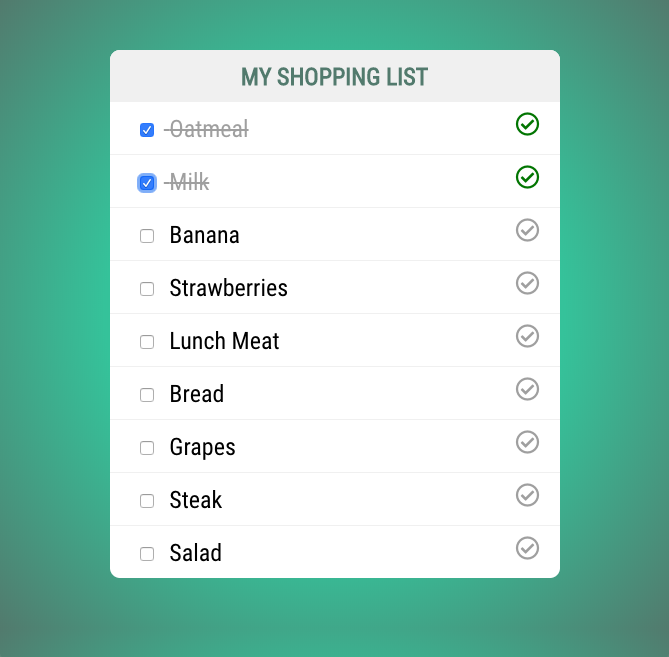

# Vue Event Handling Exercise

In this exercise you will be adding some event handling to your shopping list application. The starter code for the shopping list exercise has been provided for you and is located in this folder.

This exercise is made up of 2 parts so please make sure that when you have completed part 1 you move on to part 2.

## Part 1: Checkbox Event Handler

In part 1 of this exercise you will be adding event handling to the shopping list. This functionality is very similar to what we did in the tutorial so you can refer to that if needed.

* Add IDs to the objects in your groceries array so that they can be identified.
* Add a checkbox before the name of the grocery item.
* Add a click event handler to that checkbox that calls a method called `changeStatus()`.
* Pass the id of the item to that method
* In that method find the array index of the item that was checked
* Mark that item the inverse of what it currently is.

When you have finished part 1 you should have a shopping list that allows you to mark an item completed or incomplete.



## Part 2: A Better Solution

While the 1st solution works there is a little bit of flaw with it. To mark a task as incomplete/complete you have to check the checkbox.

You have a whole list item row that you can take advantage. In part 2 of this exercise you are going to move the click event handler to the list item. Remove the click handler from the checkbox and add it to the `<li></li>`.


This will not come without some challenges so here are tips to get you going.

* You can add a style to the li that makes it appear as clickable when you mouse over it.
* If your user were to click anywhere on the li you will need to check or un-check the checkbox.


## Exercise Tests

To consider your exercise a success we will run automated tests against it. Those tests will check for the following criteria.

* You should have a shopping ist on your page that is made up of an `<ul></ul>` and at least 1 `<li></li>`.
* None of your list items should be completed when the application loads.
* When a list item is clicked the class `.completed` is added to the list item.


If you want to run the tests you can run the following command

```bash
npm run test:e2e
```
