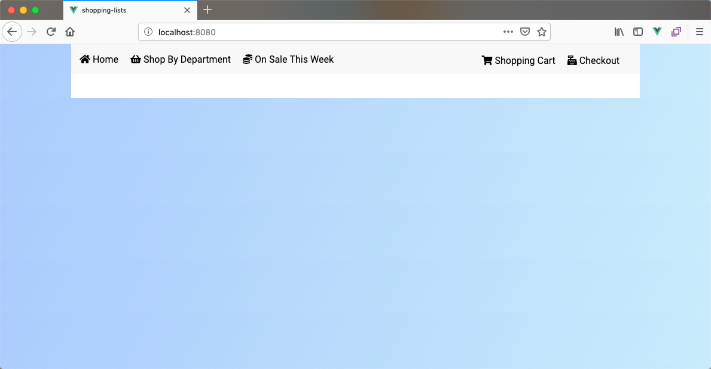

# Vue Router Student Exercise

In the past few exercises you have been building out shopping lists. This exercise is going to expand on that a bit and give you an entire online grocery store. Most of the functionality for this application has been built out for you except for the routes and some features that you will fill in. It will be your job to configure the routes as well as add router links throughout the application.

## Starting Code

The starting code for this application is located in `/shopping-lists`. Take some time to look around the code to see how it was created. Before you can do anything you will need to run `npm install`. When you run the application (`npm run serve`) it will look empty at this point but it should run without problems.



## Exercise Instructions

Please follow the instructions below in order to complete this exercise.

### Basic Paths

The first thing you need to do is to configure some of the basic routes in the application. Each of the following are views located in the `/src/views` folder. You will need to import that view and then use the information below to configure each of the routes.

- Home.vue
  - path: '/'
  - name: 'home'
- Products.vue
  - path: '/products'
  - name: 'products'
- WeeklySpecials.vue
  - path: '/on-sale'
  - name: 'weekly-specials'
- ShoppingCart.vue
  - path: '/cart'
  - name: 'cart'
- Checkout.vue
  - path: '/checkout'
  - name: 'checkout'

With the routes in place you should be able to visit each of those paths to verify that everything is working (e.g. `/`, `/products`, `/on-sale`, `/cart`, and `/checkout`). 

### Navigation

The home page includes some fake copy and a button with the text "Shop By Department". Your next task is to turn this normal button into a link to the Products page while keeping the button element intact.

After making the button functional you should focus on the navigation in the header. Right now the header looks like this:

```html
<header>
  <ul class="nav">
    <li><i class="fas fa-home"></i>Home</li>
    <li><i class="fas fa-shopping-basket"></i>Shop By Department</li>
    <li><i class="fas fa-coins"></i>On Sale This Week</li>
  </ul>
  <ul class="nav-right">
    <li><i class="fas fa-shopping-cart"></i>Shopping Cart</li>
    <li><i class="fas fa-cash-register"></i>Checkout</li>
  </ul>
</header>
```

You will need to update it so that each of the navigation items links to the correct page. You will need to have the rendered output look like the following (all the way down to the classes on the `<a>` tag) but instead of using the anchor (`<a>`) tag you will want to use one of the components provided to you by the Vue Router.

```html
<ul class="nav">
  <li><a href="/" class="home"><i class="fas fa-home"></i>Home</a></li>
  <li><a href="/products" class="products"><i class="fas fa-shopping-basket"></i>Shop By Department</a></li>
  <li><a href="/on-sale" class="onsale"><i class="fas fa-coins"></i>On Sale This Week</a></li>
</ul>
<ul class="nav-right">
  <li><a href="/cart" class="cart"><i class="fas fa-shopping-cart"></i>Shopping Cart</a></li>
  <li><a href="/checkout" class="checkout"><i class="fas fa-cash-register"></i>Checkout</a></li>
</ul>
```

> Make sure you have the correct classes applied to the generated links because the tests rely on them.

### Products

After you have updated the "Shop By Department" button and the navigation links you should be able to get to the main products page. This page will need to list out all of the departments in your online grocery store. 

When looking at the code in `/src/views/Products.vue`, you will find an array of departments that contains the path, banner and class for each department. 

```javascript
departments: [
  { path: '/produce', banner: 'produce_banner.png', class: 'produce' },
  { path: '/dairy', banner: 'dairy_banner.png', class: 'dairy' },
  { path: '/meat', banner: 'meat_banner.png', class: 'meat' },
  { path: '/bakery', banner: 'bakery_banner.png', class: 'bakery' }
]
```

You should loop over this data to create 4 image links that link to each department. 

- /products/produce
- /products/dairy
- /products/meat
- /products/bakery

The HTML that you generate should look like this (while using the correct Vue Router component).

```html
<a href="/products/produce" class="department produce">
  
</a>
<a href="/products/dairy" class="department dairy">
  
</a>
<a href="/products/meat" class="department meat">
  
</a>
<a href="/products/bakery" class="department bakery">
  
</a>
```

> When building your image paths you should use `v-bind:src="require('../assets/images/' + department.banner)"`


To make the links work you will need to setup a dynamic route. The path for this route will be `/products/` + department. The name for this route will be `products-list` and it will be handled by `/src/views/ProductsList.vue`.


> Make sure you add the class to each link or the tests will fail.

#### Products List

Now that you can get to the products listing page for each department you need to do something to make the `ProductsList.vue` component work. When the component is created you will want to call the `getProducts()` method and pass the department that the user clicked on.

If the Products Listing component is working correctly you should see a list of 8 products for each department. 

Your last task is to add a route in the router configuration that will make the link for each product work. The `<router-link>` already exists (in `/src/components/ProductsList.vue`) and will navigates users to `products/sku/` + sku. To make it work, you will need to setup a dynamic route in the router configuration file.

When complete you should be able to click on the product details button from any department page or the weekly specials page to view a product's details.

## Tests

The tests for this exercise are located in `shopping-lists/tests/e2e/specs/shopping-tests.js`. If you want to check your work you can run the tests by running the command `npm run test` which will run a headless version of the integration tests. If you want to run the tests so that they open in the UI and give you more information as to what is going on you can run the command `npm run test:e2e`. If you have done everything correctly you should have 19 tests passing.
